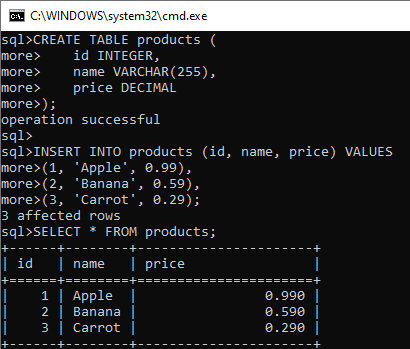

# MonetDB review

### a. История развития СУБД MonetDB

MonetDB — это колоночная реляционная база данных, разработка которой началась в 1993 году в Центре математики и информатики в Нидерландах. Проект был запущен в рамках исследовательской программы, направленной на улучшение производительности запросов в базах данных за счёт использования новых архитектурных подходов, таких как колоночное хранение данных. С тех пор MonetDB эволюционировала, став одной из первых систем управления базами данных, применивших колоночное хранение для оптимизации операций аналитической обработки данных

### b. Инструменты для взаимодействия с СУБД MonetDB

- **MonetDB SQL**: интерфейс командной строки для выполнения SQL-запросов
- **JDBC и ODBC драйверы**: позволяют подключаться к MonetDB из различных программных приложений
- **Python, R, и PHP библиотеки**: предоставляют API для взаимодействия с базой данных
- **MonetDBLite**: встраиваемая версия MonetDB, которая может использоваться непосредственно в приложениях, например, в аналитических

### c. Database engine, используемый в MonetDB

MonetDB использует специализированный колоночный движок для обработки и хранения данных. Этот движок оптимизирован для выполнения больших аналитических запросов и операций с большими массивами данных, обеспечивая высокую производительность за счёт эффективного сжатия данных и быстрой агрегации

### d. Язык запросов и выполнение запросов в MonetDB

MonetDB использует стандарт SQL для языка запросов. Абсолютно стандартный набор команд:

1. Создание таблицы:
   ```sql
   CREATE TABLE example (id INTEGER, name VARCHAR(255));
   ```
2. Вставка данных:
   ```sql
   INSERT INTO example VALUES (1, 'Alice'), (2, 'Bob');
   ```
3. Выполнение запроса:
   ```sql
   SELECT * FROM example;
   ```

### e. Распределение файлов БД по разным носителям

MonetDB хранит данные в колоночном формате, где каждый столбец таблицы сохраняется в отдельном файле на диске. Это позволяет эффективно читать и записывать данные, особенно при выполнении запросов, затрагивающих лишь некоторые столбцы таблицы. Распределение файлов по разным носителям может быть настроено на уровне файловой системы, но сама СУБД не предоставляет встроенных средств для распределения файлов по разным дискам или устройствам

### f. Язык программирования, на котором написана СУБД MonetDB
MonetDB написана преимущественно на языке C (см исходный код на [github](https://github.com/MonetDB)), но есть и другие, такие как Java, Python

### g. Типы индексов, поддерживаемые в MonetDB
MonetDB использует колоночную модель данных и не предлагает традиционные индексы, как в других реляционных базах данных (например, B-tree). Вместо этого, оптимизация запросов осуществляется за счет структур данных, специфичных для колоночного хранения. Однако, можно создавать `imprints` индексы, которые являются оптимизацией для ускорения выборок по столбцам

Пример создания `imprints` индекса:
```sql
CREATE IMRINTS ON tablename(columnname);
```
В MonetDB "imprints" являются продвинутым механизмом индексации, который значительно улучшает скорость выполнения запросов, особенно при обработке больших объемов данных. Это технология, ориентированная на колоночные базы данных, где каждый столбец данных хранится отдельно.

#### Как работают imprints

"Imprints" в MonetDB — это легковесные вторичные индексы, которые создаются для столбцов в базе данных. Они предоставляют своего рода "мета-информацию" о содержимом блоков данных в столбце:

1. **Сжатие**: Imprints используют сжатие для уменьшения объема хранения метаданных. Каждый блок данных в столбце сопровождается миниатюрным "отпечатком", который содержит сжатую информацию о значениях в блоке

2. **Блочное деление**: Данные в столбце делятся на блоки, для каждого из которых создается imprint. Эти импринты позволяют быстро определить, содержит ли блок данные, соответствующие критериям запроса, без необходимости сканирования всех данных в блоке

3. **Фильтрация**: При выполнении запроса, например, при поиске определенных значений, система сначала проверяет импринты для быстрой оценки того, в каких блоках могут находиться интересующие данные. Если импринт указывает, что блок не содержит искомых данных, этот блок можно сразу исключить из дальнейшего поиска

### h. Процесс выполнения запросов в MonetDB
Процесс выполнения запросов в MonetDB начинается с парсинга SQL-запроса, его оптимизации и генерации плана выполнения. Оптимизатор запросов выбирает наиболее эффективный способ выполнения запроса на основе статистики и метаданных о данных. После этого запрос выполняется в MonetDB

### i. План запросов в MonetDB
Да, есть понятие "план запросов" - детализированное представление того, как база данных будет выполнять заданный SQL-запрос. Можно использовать команду `EXPLAIN` для просмотра плана запроса. План показывает последовательность операций, таких как сканирование таблиц, присоединения, сортировки и агрегации, которые база данных предполагает использовать для получения результатов.

Пример использования `EXPLAIN`:
```sql
EXPLAIN SELECT * FROM example WHERE id > 1;
```

### j. Поддержка транзакций в MonetDB
MonetDB поддерживает транзакционные модели согласно стандарту ACID.

Пример использования транзакций:
```sql
BEGIN TRANSACTION;
INSERT INTO example VALUES (3, 'Charlie');
COMMIT;
```

В этом примере начало транзакции, изменение данных и их подтверждение. Если необходимо откатить изменения, можно использовать `ROLLBACK` вместо `COMMIT`

### k. Методы восстановления в MonetDB
MonetDB предоставляет базовые механизмы восстановления данных, включая регулярное создание резервных копий (backups) и восстановление из них. Также, как и многие другие СУБД, MonetDB поддерживает журналирование транзакций, что позволяет восстанавливать данные после сбоев. Восстановление данных возможно до последней успешно зафиксированной транзакции

Пример создания резервной копии:
```sql
CALL sys.create_snapshot();
```

Эта команда создает снимок текущего состояния базы данных, который затем может быть использован для восстановления

### l. Шардинг в MonetDB
В MonetDB нет встроенных средств для реализации шардинга на уровне базы данных. Шардинг данных обычно происходит на уровне приложения или используя внешние утилиты и решения, которые распределяют данные по разным экземплярам MonetDB для горизонтального масштабирования. Это может быть достигнуто через разбиение данных на отдельные таблицы или базы данных на разных серверах

### m. Применение терминов Data Mining, Data Warehousing и OLAP в MonetDB
MonetDB эффективно подходит для задач Data Warehousing и OLAP благодаря своей колоночной архитектуре, которая оптимизирована для быстрых агрегаций и аналитических запросов на больших объемах данных. Для Data Mining MonetDB сама по себе не предоставляет специализированных инструментов, но она может быть использована в качестве платформы для аналитики с применением внешних инструментов и библиотек

### n. Методы защиты в MonetDB
MonetDB предлагает несколько механизмов защиты данных:
- **Шифрование трафика**: Поддержка SSL для защиты данных, передаваемых между клиентом и сервером
- **Аутентификация**: Поддержка стандартных механизмов аутентификации, включая пароли
- **Управление доступом**: Возможность определения ролей и разграничения доступа к данным

В целом, MonetDB предоставляет базовые, но эффективные механизмы безопасности

### o. Сообщества, развивающие MonetDB

Если смотреть на их [github](https://github.com/MonetDB), то репозиторий обновляется постояно, при этом в people большинство людей из Амстердама. Это говорит о том, что основной источник разивития так и остался тот самый университет, где было всё придумано, однако есть и другие участники

### p. Создание собственных данных для демонстрации работы СУБД

Для демонстрации работы с MonetDB можно создать простую таблицу и наполнить её данными. Вот пример SQL-кода для создания таблицы и вставки данных:

```sql
CREATE TABLE products (
    id INTEGER,
    name VARCHAR(255),
    price DECIMAL
);

INSERT INTO products (id, name, price) VALUES
(1, 'Apple', 0.99),
(2, 'Banana', 0.59),
(3, 'Carrot', 0.29);
```

Пример исполненого кода:



### q. Самостоятельное изучение языка запросов

Так как это обычный SQL, то можно использовать что угодно

### r. Документация и обучение

Документацию по MonetDB можно найти на официальном сайте проекта ([MonetDB website](https://www.monetdb.org/)). Примеры использования, руководства и описания особенностей работы системы

### s. Как быть в курсе происходящего

Чтобы быть в курсе последних новостей и обновлений MonetDB, можно следить за:
- **Официальным сайтом MonetDB**, где регулярно публикуются обновления и новости
- **GitHub репозиторием MonetDB**, где можно наблюдать за текущими изменениями в коде и участвовать в обсуждениях

## Источники информации 

- **Официальный сайт MonetDB**  
  [MonetDB Website](https://www.monetdb.org/)  
  Официальный сайт проекта MonetDB, где доступны скачивание дистрибутивов, документация, технические характеристики и последние новости проекта

- **Документация MonetDB**  
  [MonetDB Documentation](https://www.monetdb.org/Documentation/)  
  Содержит подробные руководства, описание функциональных возможностей и примеры использования MonetDB, а также инструкции по установке и настройке

- **GitHub репозиторий MonetDB**  
  [MonetDB GitHub](https://github.com/MonetDB/MonetDB)  
  Репозиторий проекта на GitHub, где можно ознакомиться с исходным кодом, следить за разработкой и участвовать в улучшении проекта

- **Tag на StackOverflow**  
 [Stack Overflow](https://stackoverflow.com/questions/tagged/monetdb)
